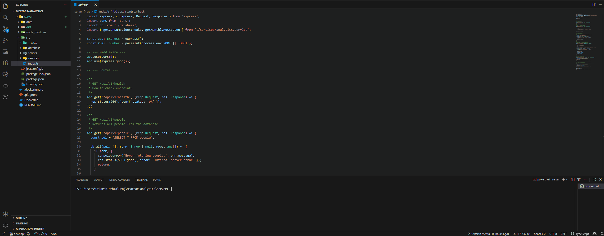

# MeatBar Analytics Backend

This is a Node.js, TypeScript, and SQLite backend API built as a technical assignment for Renaissance. The API provides RESTful endpoints to process and expose data about meat bar consumption.

## Tech Stack

* **Backend:** Node.js, Express, TypeScript
* **Database:** SQLite
* **Testing:** Jest, ts-jest


## Demo



## How to Set Up and Run


### Prerequisites

* Node.js (v16 or newer recommended)

### 1. Clone & Install

    # 1. Clone the repository
    git clone https://github.com/utkarshmehta/meatbar-analytics.git

    # 2. Navigate to the server directory
    cd meatbar-analytics/server

    # 3. Install all dependencies
    npm install

### 2. Build the Database

The project includes a setup script to parse the data.csv file and populate the database.db file. This only needs to be run once.

    # From the /server directory
    npx ts-node src/scripts/setup.ts

### 3. Run the Application

Once the database is built, you can start the server.

    # Run in development mode (with auto-reload)
    npm run dev

The server will be running on `http://localhost:3001`

### 4. Run Tests

All critical logic is unit-tested with Jest.

    # Run all tests
    npm run test

### 5. Run via Docker (Recommended for Reviewers)

The simplest way to run this application is using Docker, as it handles all dependencies automatically.

1.  **Build the image:**
        docker build -t meatbar-analytics .

2.  **Run the container:** (The container automatically builds the SQLite database on startup)
        docker run -p 3001:3001 meatbar-analytics

3.  The API will be available at `http://localhost:3001/api/v1/people`


## API Endpoints

### Health

* **`GET /api/v1/health`**
    * Returns `{"status": "ok"}`. Used to verify the server is running.

### People

* `GET /api/v1/people`
    * Returns a JSON array of all people in the database.

### Consumptions

* `GET /api/v1/consumptions`
    * Returns a JSON array of all meat bar consumption events.

* `POST /api/v1/consumptions`
    * Adds a new meat bar consumption event.
    * **Body (JSON):**
    ```json
    {
      "person_name": "ashton",
      "type": "bison",
      "eaten_at": "2025-01-01T12:00:00.000Z"
    }
    ```

### Analytics

* `GET /api/v1/analytics/streaks`
    * Returns all consumption streaks, defined as consecutive days (ignoring gaps) of *increasing* daily consumption.
    **Example Response:**
    ```json
    [
      {
        "streak_id": 2,
        "streak_length": 3,
        "streak_start": "2015-01-03",
        "streak_end": "2015-01-07",
        "streak_counts": "1, 2, 3"
      }
    ]
    ```

* `GET /api/v1/analytics/monthly-most`
    * For each month, returns the day of the month that had the highest number of consumptions.
    **Example Response:**
    ```json
    [
      {
        "consumption_month": "2015-01",
        "day_of_month": "15",
        "daily_count": 8
      },
      {
        "consumption_month": "2015-05",
        "day_of_month": "01",
        "daily_count": 3
      }
    ]
    ```