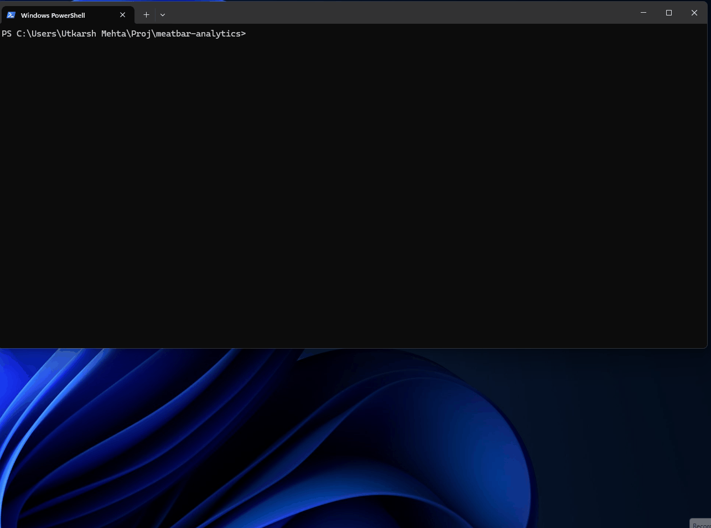
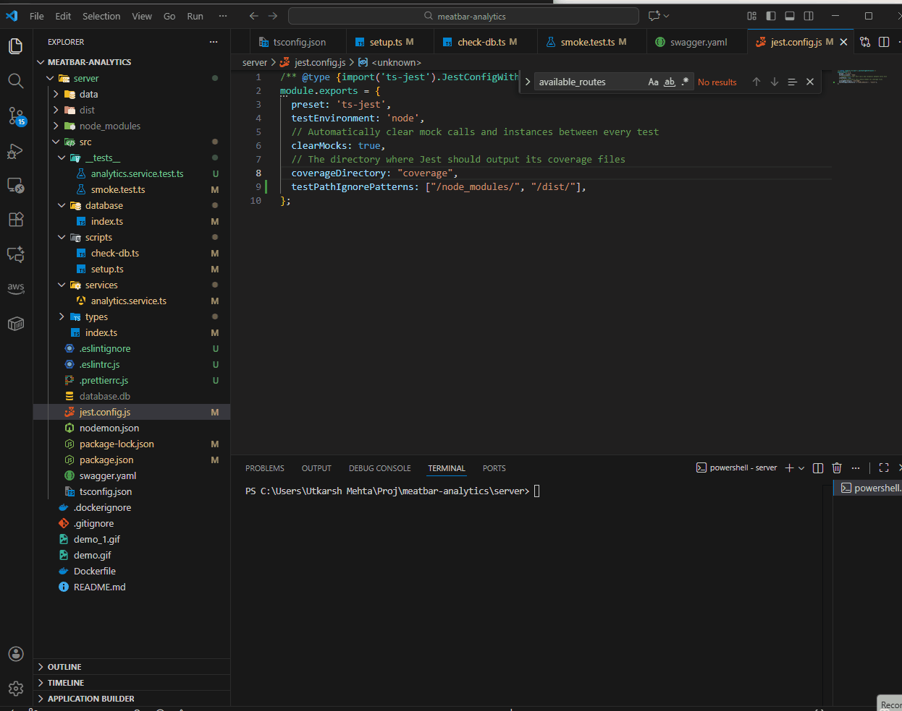

# MeatBar Analytics Backend


## Tech Stack

* **Backend:** Node.js, Express, TypeScript
* **Database:** SQLite
* **Testing:** Jest, ts-jest
* **Code Quality:** ESLint, Prettier

## Demo


## Documentation

The full, interactive OpenAPI (Swagger) documentation is available at `http://localhost:3001/api-docs` after running the application.

---

## How to Set Up and Run

### Prerequisites

* Node.js (v16 or newer recommended)
* Docker (Recommended for easy setup)

### 1. Run via Docker

This is the simplest way to run the application, as it handles all setup and dependencies automatically.

1.  **Build the image:**
    ```bash
    docker build -t meatbar-analytics .
    ```

2.  **Run the container:** (The container automatically builds the SQLite database on startup)
    ```bash
    docker run -p 3001:3001 meatbar-analytics
    ```

3.  The API will be available at `http://localhost:3001/` and the interactive documentation at `http://localhost:3001/api-docs`.

## Docker DEMO



### 2. Manual Setup (Without Docker)

If you prefer to run the application manually:

1.  **Clone & Install:**
    ```bash
    # 1. Clone the repository
    git clone [https://github.com/utkarshmehta/meatbar-analytics.git](https://github.com/utkarshmehta/meatbar-analytics.git)

    # 2. Navigate to the server directory
    cd meatbar-analytics/server

    # 3. Install all dependencies
    npm install
    ```

2.  **Build the Database:**
    ```bash
    # This only needs to be run once.
    # From the /server directory
    npx ts-node src/scripts/setup.ts
    ```

3.  **Run the Application:**
    ```bash
    # Run in development mode (with auto-reload)
    npm run dev
    ```
    The server will be running on `http://localhost:3001`

## Code Quality & Testing

From the `server/` directory, you can run the following commands:

* **Run all tests:**
    ```bash
    npm run test
    ```

* **Check for linting errors:**
    ```bash
    npm run lint
    ```

* **Automatically format all code:**
    ```bash
    npm run format
    ```
## Key Implementation Assumptions

- Uniqueness & Data Integrity: To prevent duplicate entries during the initial CSV load and subsequent POST requests, a unique constraint is enforced on the combination of (person_name, type, eaten_at) in the meat_bars table.

- Data Structure: As permitted by the requirements, the database uses a lightweight, semi-denormalized structure, linking consumption records to people directly by person_name (a string lookup) rather than a separate integer foreign key.

- Time Zone Handling: All date and time fields (eaten_at) are stored and queried using standard SQLite date functions based on the raw UTC text string from the source data.

- Consumption Streaks: The streak calculation strictly ignores any days with zero consumption, as required by the business logic.
## Testing DEMO



## API Endpoints

### Health

* `GET /api/v1/health`
    * Returns `{"status": "ok"}`. Used to verify the server is running.

### People

* `GET /api/v1/people`
    * Returns a JSON array of all people in the database.

### Consumptions

* `GET /api/v1/consumptions`
    * Returns a JSON array of all meat bar consumption events.

* `POST /api/v1/consumptions`
    * Adds a new meat bar consumption event.
    * **Body (JSON):**
        ```json
        {
          "person_name": "ashton",
          "type": "bison",
          "eaten_at": "2025-01-01T12:00:00.000Z"
        }
        ```

### Analytics

* `GET /api/v1/analytics/streaks`
    * Returns all consumption streaks, defined as consecutive days (ignoring gaps) of *increasing* daily consumption.
    * **Example Response:**
        ```json
        [
          {
            "streak_id": 2,
            "streak_length": 3,
            "streak_start": "2015-01-03",
            "streak_end": "2015-01-07",
            "streak_counts": "1, 2, 3"
          }
        ]
        ```

* `GET /api/v1/analytics/monthly-most`
    * For each month, returns the day of the month that had the highest number of consumptions.
    * **Example Response:**
        ```json
        [
          {
            "consumption_month": "2015-01",
            "day_of_month": "15",
            "daily_count": 8
          },
          {
            "consumption_month": "2015-05",
            "day_of_month": "01",
            "daily_count": 3
          }
        ]

        ```

